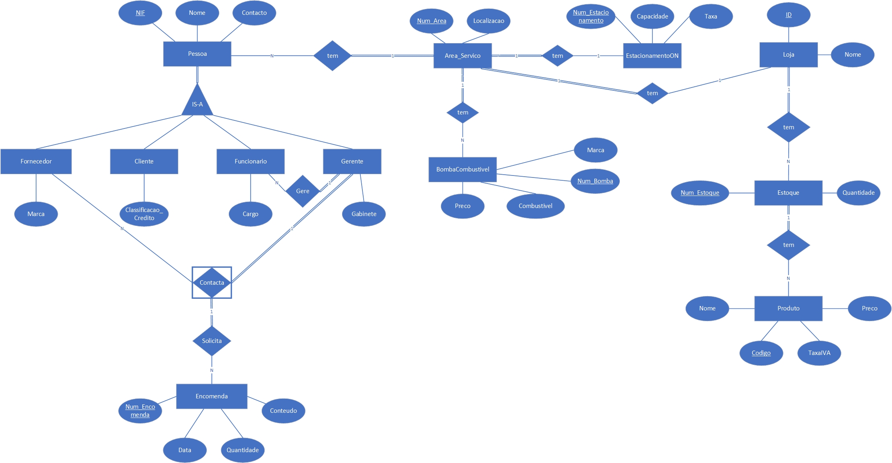
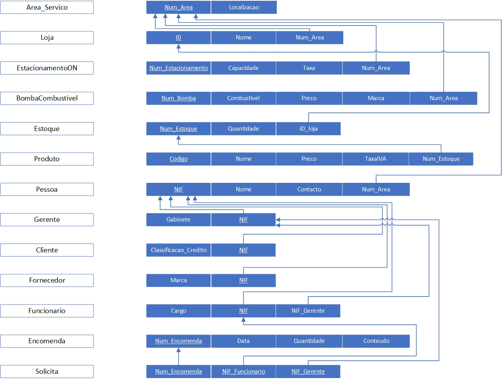

# BD: Trabalho Prático APFE

**Grupo**: P1G8
- Guilherme Santos, MEC: 107961
- João Gaspar, MEC: 107708

## Introdução / Introduction
 
Sistema para gerir uma área de serviço com loja, bomba de gasolina e estacionamento overnight.

## ​Análise de Requisitos / Requirements

Entidades e os seus Atributos: 
Area de Serviço (Num_Area, localizacao) 
Loja (ID, nome) 
Estacionamento_Overnight(Num_Estacionamento, capacidade, taxa) 
Bomba de Gasolina (Num_Bomba,  combustivel, preco, marca) 
Estoque (Num_Estoque, quantidade) 
Produto (Codigo, nome, preco, TaxaIVA) 
Encomenda (Num_Encomenda, data, quantidade, conteudo) 
Pessoa (NIF, Nome, Contacto) 

Sub-entidades da Entidade “Pessoa” e os seus Atributos: 
Cliente (classificação_Credito) 
Funcionário (Cargo) 
Fornecedor (Marca) 
Gerente (Gabinete) 

Relacionamentos: 
Uma área de serviço tem uma loja, e um estacionamento overnight (1:1). 
Uma área de serviço tem várias bombas de gasolina (1:N). 
Uma loja tem um estoque, e um estoque tem vários produtos (1:N). 
Uma Área de Serviço tem várias pessoas (1:N). 
Uma pessoa pode ser um cliente, funcionário, gerente ou fornecedor. 
Um gerente supervisiona vários funcionários (1:N). 
Um gerente contacta vários fornecedores (1:N) e solicita para cada um uma encomenda (1:N). 

## DER

## ER

